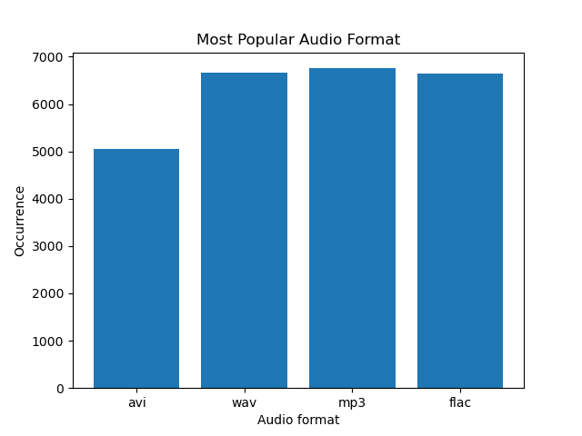
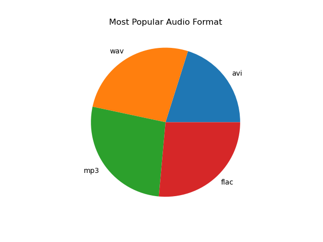
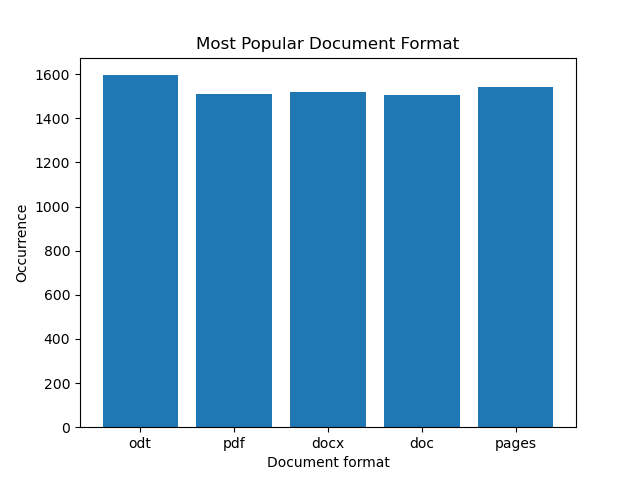
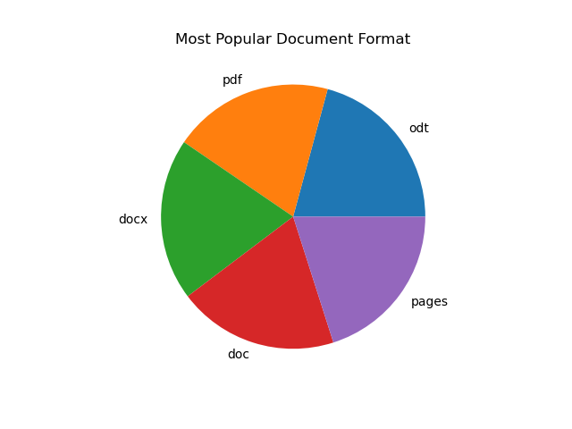
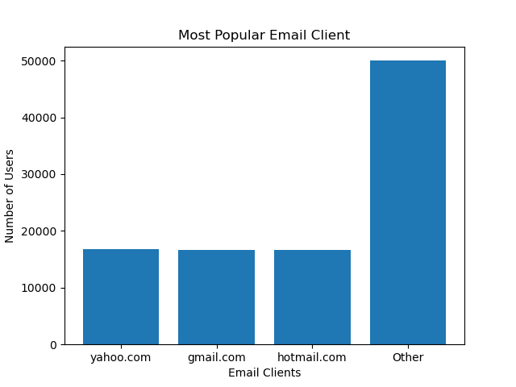
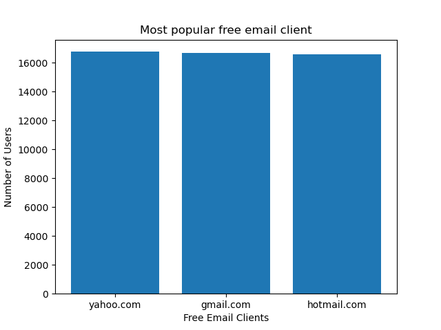
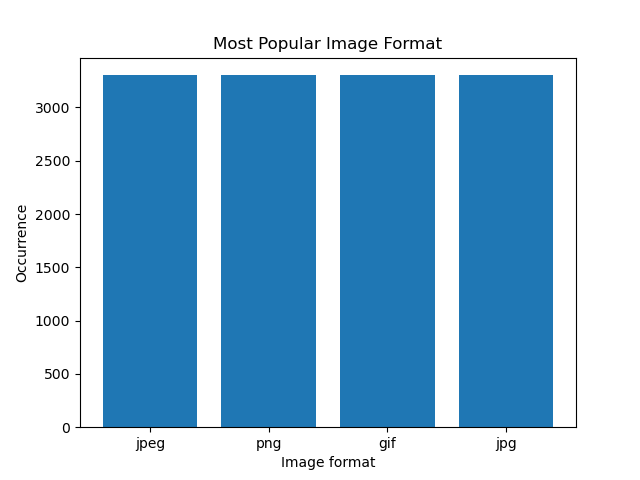

# Table of Contents

* [Introduction](#introduction)
* [Installation](#installation)
* [The Test](#the-test)
* [License](#license)
* [Troubleshooting](#troubleshooting)

# Introduction
This test is a conglomeration of multiple python scripts that I would typically
use to run some analysis on data I collected. For this case the data was randomly
generated by using the python package `Faker`. The example data used for this analysis
is stored in the `/data` directory of this repository as `data.csv`. I use the variety
of python scripts to analyze the data. Here is a list of each python scripts with a short
description of what each one does:

* **`analysis`:** Run a series of analyses on some data I collected
* **`fakedatagen`:** Create fake data for testing (if you want to make your own)
* **`fragmentor`:** Split a `.csv` file into smaller chunks.
* **`graphgen`:** Create graphs based on the `xml` data generated by `analysis`

Where GNU parallel comes into play is that `data.csv` has 100,000 entries in it,
and I want to speed up the analysis. Therefore, I wrote `fragmentor` in order to
break the file into smaller chunks and then use GNU parallel to run my analysis in
parallel. This is where `analysis` comes into play. After it has analyzed the chunk
it was given, it creates an `xml` entry. That `xml` entry is then written to a `.xml` file.
`graphgen` then takes in those `.xml` files, parses the data, and then generates the
relevant graphs. The graphs are then put into a `zip` archive that can then be
download to a local machine.

# Installation
Setting up the testing environment is very easy! All you need to do is use the
`setup.sh` file that is included in this repository. All you need to do is use
the following commands:

```bash
$ module load git/1.9.4
$ cd ~/work
$ git clone https://github.com/NucciTheBoss/python_gnu_parallel_test_aci.git
$ cd python_gnu_parallel_test_aci
$ bash setup.sh
```

**IMPORTANT:** You need to clone the `python_gnu_parallel_test_aci` repo into your
`work` directory in order for the installer to work correctly.

What this installer will do is create the conda environment needed for the test
and create the `analysis`, `fakedatagen`, `fragmentor`, and `graphgen` executables.
The script will provide you with the path that you need to add to your `PATH`
environment variable in order to use the executables.

#### Note
Should you ever want to create your own fake data to use with this test
then just use the following commands:

```bash
$ export PATH=${HOME}/work/python_gnu_parallel_test_aci/bin:${PATH}
$ fakedatagen -c <integer> -o </desired/output/path/file.csv> 
```

# The Test

* [Activating the python_gnu_parallel environment](#activating-the-python_gnu_parallel-environment)
* [Submitting a batch job](#submitting-a-batch-job)

## Activating the python_gnu_parallel environment
Let's say that you have a conda package that you want to add to your environment.
This test here is to verify that you can successfully load the `python_gnu_parallel`
environment and install a simple package. Use the following commands to conduct the test:

```bash
$ module load python/3.6.3-anaconda5.0.1
$ source activate python_gnu_parallel
$ conda install -c conda-forge tabulate
$ python -c "from tabulate import tabulate"
```

If there are no error messages received then the test is a success!

## Submitting a batch job
Time to run the analysis! Simply use the following commands in order to submit
the job:

```bash
$ cd ~/work/python_gnu_parallel_test_aci
$ qsub analysis.pbs
```

The job should only take a few minutes to complete thanks to GNU parallel.
Just make sure that you are a member of the `wff3_b_g_bc_default` allocation.
Once the job has finished you should be able to find the file `analysis_output.zip`
and the directory `analysis_output` in your work directory. The graphs will be
stored in `analysis_output`. There will be 10 graphs in total. They should look 
the following (if you use the default `data.csv` file):

* [Most Popular Audio Format Bar Graph](#most-popular-audio-format-bar-graph)
* [Most Popular Audio Format Pie Chart](#most-popular-audio-format-pie-chart)
* [Most Popular Document Format Bar Graph](#most-popular-document-format-bar-graph)
* [Most Popular Document Format Pie Chart](#most-popular-document-format-pie-chart)
* [Most Popular Email Client Bar Graph](#most-popular-email-client-bar-graph)
* [Most Popular Email Client Pie Chart](#most-popular-email-client-pie-chart)
* [Most Popular Free Email Client Bar Graph](#most-popular-free-email-client-bar-graph)
* [Most Popular Free Email Client Pie Chart](#most-popular-free-email-client-pie-chart)
* [Most Popular Image Format Bar Graph](#most-popular-image-format-bar-graph)
* [Most Popular Image Format Pie Chart](#most-popular-image-format-pie-chart)

#### Most Popular Audio Format Bar Graph


#### Most Popular Audio Format Pie Chart


#### Most Popular Document Format Bar Graph


#### Most Popular Document Format Pie Chart


#### Most Popular Email Client Bar Graph


#### Most Popular Email Client Pie Chart


#### Most Popular Free Email Client Bar Graph


#### Most Popular Free Email Client Pie Chart


#### Most Popular Image Format Bar Graph


#### Most Popular Image Format Pie Chart


If your graphs look like the above then the test was a success!

# License
This repository is licensed under the GNU General Public License v3.0. 
For more information on what this license entails, please feel free to 
visit https://www.gnu.org/licenses/gpl-3.0.en.html

# Troubleshooting
If you encounter any issues with the code in this repository while 
testing the RHEL7 nodes then please contact Jason at either jcn23@psu.edu 
or at iask@ics.psu.edu
